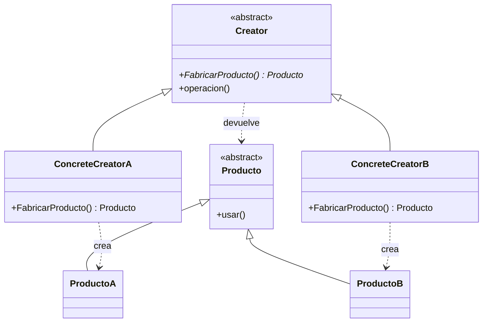
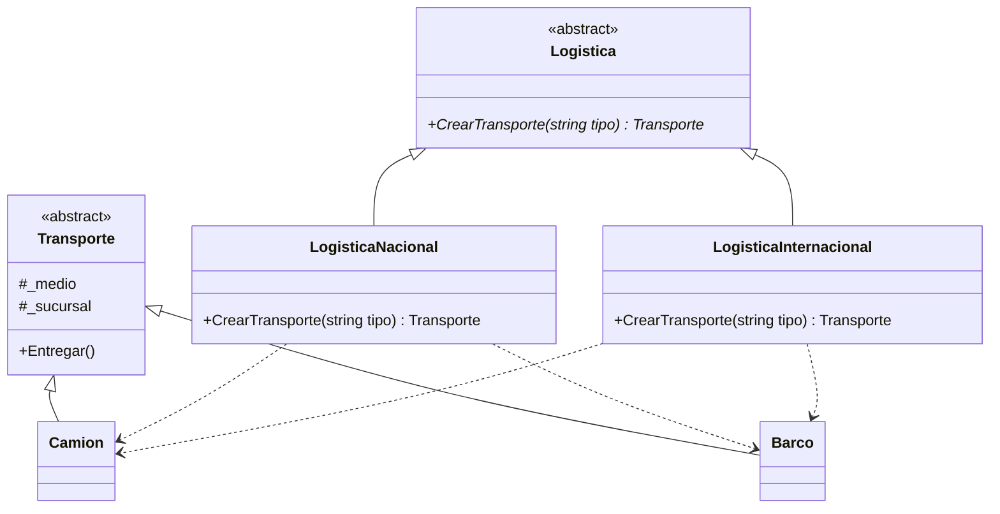
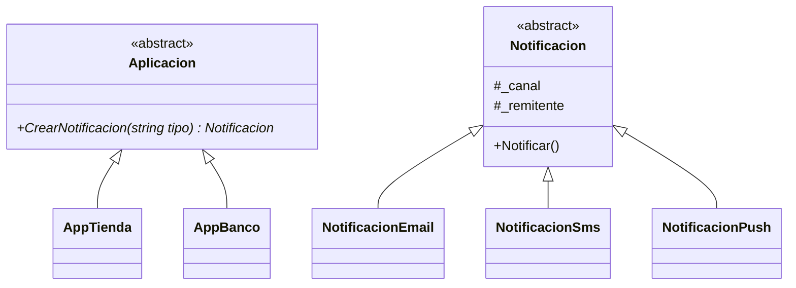

# Patrón Factory Method (Método Fábrica)

## ¿Qué resuelve?
Define una **interfaz para crear un objeto**, pero deja que las **subclases decidan qué clase concreta instanciar**.
La clase base contiene la lógica general; el "método fábrica" (abstracto) es el único hueco que cada subclase rellena.

> **Idea clave:** "Una sola familia de productos, pero distintas variantes según quién la fabrica."
> Lo reconocés cuando hay **UN método abstracto que devuelve un producto** y subclases que lo sobrescriben.

## Estructura del patrón

| Rol | Quién es en el ejemplo de la cátedra (Pizzería) |
|-----|--------------------------------------------------|
| **Creator** (abstracto) | `Pizzeria` con `CrearPizza()` |
| **ConcreteCreator** | `PizzeriaArgentina`, `PizzeriaItaliana` |
| **Product** (abstracto) | `Pizza` |
| **ConcreteProduct** | `PizzaCancha`, `PizzaNapolitana` |

## Diagrama de clases (genérico)



---

## Ejercicio 1 — Logística (Transporte)

> Una empresa de logística entrega paquetes. Cada sucursal (Nacional o Internacional) decide, según el tipo pedido, si usa un `Camion` o un `Barco`. El método fábrica recibe el `tipo` y devuelve el transporte concreto, ya marcado con su sucursal.

### Diagrama



### Código

```csharp
// ---------- Producto abstracto ----------
public abstract class Transporte
{
    protected string _medio;
    protected string _sucursal;

    public void Entregar()
    {
        Console.WriteLine(string.Format("Entregando con {0} desde la sucursal {1}.", _medio, _sucursal));
    }
}

// ---------- Productos concretos ----------
public class Camion : Transporte
{
    public Camion(string sucursal)
    {
        _medio = "camión";
        _sucursal = sucursal;
    }
}

public class Barco : Transporte
{
    public Barco(string sucursal)
    {
        _medio = "barco";
        _sucursal = sucursal;
    }
}

// ---------- Creator abstracto ----------
public abstract class Logistica
{
    // Factory Method: recibe el tipo y devuelve el transporte concreto
    public abstract Transporte CrearTransporte(string tipo);
}

// ---------- Creators concretos ----------
public class LogisticaNacional : Logistica
{
    public override Transporte CrearTransporte(string tipo)
    {
        if (tipo == "camion")
        {
            return new Camion("Nacional");
        }
        else if (tipo == "barco")
        {
            return new Barco("Nacional");
        }
        else
        {
            return null;
        }
    }
}

public class LogisticaInternacional : Logistica
{
    public override Transporte CrearTransporte(string tipo)
    {
        if (tipo == "camion")
        {
            return new Camion("Internacional");
        }
        else if (tipo == "barco")
        {
            return new Barco("Internacional");
        }
        else
        {
            return null;
        }
    }
}

// ---------- Cliente ----------
class Program
{
    static void Main()
    {
        Logistica logistica;
        Transporte transporte;

        logistica = new LogisticaNacional();
        transporte = logistica.CrearTransporte("camion");
        transporte.Entregar();
        transporte = logistica.CrearTransporte("barco");
        transporte.Entregar();

        logistica = new LogisticaInternacional();
        transporte = logistica.CrearTransporte("camion");
        transporte.Entregar();

        Console.ReadKey();
    }
}
```

---

## Ejercicio 2 — Notificaciones

> Una aplicación envía notificaciones. Cada app (Tienda o Banco) decide, según el tipo pedido, si crea una notificación de Email, SMS o Push. El método fábrica recibe el `tipo` y devuelve la notificación concreta, ya marcada con su remitente.

### Diagrama



### Código

```csharp
public abstract class Notificacion
{
    protected string _canal;
    protected string _remitente;

    public void Notificar()
    {
        Console.WriteLine(string.Format("Enviando notificación por {0} desde {1}.", _canal, _remitente));
    }
}

public class NotificacionEmail : Notificacion
{
    public NotificacionEmail(string remitente)
    {
        _canal = "Email";
        _remitente = remitente;
    }
}

public class NotificacionSms : Notificacion
{
    public NotificacionSms(string remitente)
    {
        _canal = "SMS";
        _remitente = remitente;
    }
}

public class NotificacionPush : Notificacion
{
    public NotificacionPush(string remitente)
    {
        _canal = "Push";
        _remitente = remitente;
    }
}

public abstract class Aplicacion
{
    public abstract Notificacion CrearNotificacion(string tipo);
}

public class AppTienda : Aplicacion
{
    public override Notificacion CrearNotificacion(string tipo)
    {
        if (tipo == "email")
        {
            return new NotificacionEmail("Tienda");
        }
        else if (tipo == "sms")
        {
            return new NotificacionSms("Tienda");
        }
        else if (tipo == "push")
        {
            return new NotificacionPush("Tienda");
        }
        else
        {
            return null;
        }
    }
}

public class AppBanco : Aplicacion
{
    public override Notificacion CrearNotificacion(string tipo)
    {
        if (tipo == "email")
        {
            return new NotificacionEmail("Banco");
        }
        else if (tipo == "sms")
        {
            return new NotificacionSms("Banco");
        }
        else if (tipo == "push")
        {
            return new NotificacionPush("Banco");
        }
        else
        {
            return null;
        }
    }
}

// Cliente
class Program
{
    static void Main()
    {
        Aplicacion app;
        Notificacion notificacion;

        app = new AppTienda();
        notificacion = app.CrearNotificacion("email");
        notificacion.Notificar();
        notificacion = app.CrearNotificacion("push");
        notificacion.Notificar();

        app = new AppBanco();
        notificacion = app.CrearNotificacion("sms");
        notificacion.Notificar();
    }
}
```

---

## Cómo lo reconocés en un parcial
- Piden "crear objetos sin acoplar el cliente a la clase concreta".
- Hay **un solo tipo de producto** (Pizza, Transporte, Notificación) con variantes.
- La frase clave: *"que las subclases decidan qué crear"*.
- ⚠️ **Diferencia con Abstract Factory:** Factory Method crea **UN** producto; Abstract Factory crea **familias de varios productos relacionados**.
```
