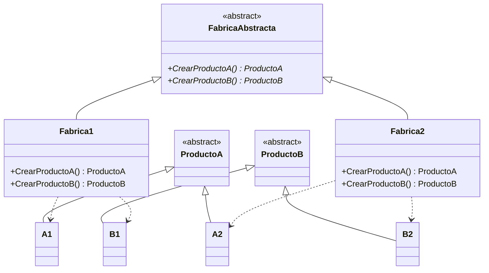
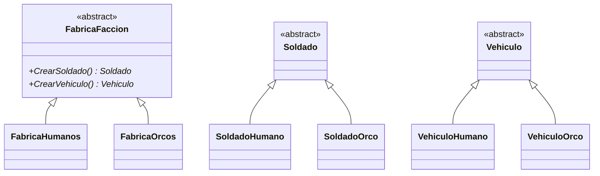
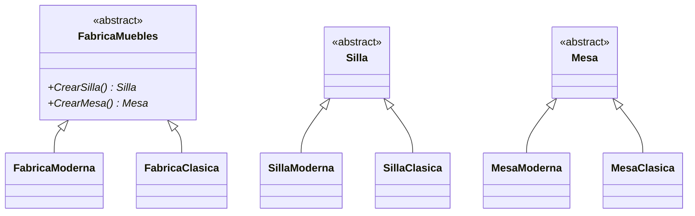

# Patrón Abstract Factory (Fábrica Abstracta)

## ¿Qué resuelve?
Permite crear **familias de objetos relacionados** sin acoplar el código a sus clases concretas.
Cada fábrica concreta produce un conjunto de productos que **combinan bien entre sí**.

> **Idea clave:** "Varias familias, cada una con VARIOS productos que deben ser coherentes."
> Lo reconocés cuando una fábrica tiene **dos o más métodos `CrearX()`** y cada fábrica concreta los implementa juntos.

## Estructura del patrón

| Rol | Ejemplo de la cátedra (Pizzería) |
|-----|----------------------------------|
| **AbstractFactory** | `Pizzeria` con `CrearPizza()` + `CrearEmpanada()` |
| **ConcreteFactory** | `PizzeriaArgentina`, `PizzeriaItaliana`, `PizzeriaChina` |
| **AbstractProductA / B** | `Pizza`, `Empanada` |
| **ConcreteProduct** | `PizzaCancha`+`EmpanadaDeCarne`, etc. |

## Diagrama de clases (genérico)



---

## Ejercicio 1 — Facciones de un videojuego

> Un juego de estrategia tiene distintas facciones (Humanos u Orcos). Cada facción produce su propio `Soldado` y su propio `Vehiculo`. No se pueden mezclar (un soldado humano con un vehículo orco sería incoherente).

### Diagrama



### Código

```csharp
// ---------- Productos abstractos ----------
public abstract class Soldado
{
    public abstract string Atacar();
}
public abstract class Vehiculo
{
    public abstract string Mover();
}

// ---------- Productos concretos: familia Humanos ----------
public class SoldadoHumano : Soldado
{
    public override string Atacar() => "Soldado humano dispara su rifle.";
}
public class VehiculoHumano : Vehiculo
{
    public override string Mover() => "Tanque humano avanza sobre sus orugas.";
}

// ---------- Productos concretos: familia Orcos ----------
public class SoldadoOrco : Soldado
{
    public override string Atacar() => "Soldado orco ataca con su hacha.";
}
public class VehiculoOrco : Vehiculo
{
    public override string Mover() => "Catapulta orca rueda hacia el enemigo.";
}

// ---------- Fábrica abstracta ----------
public abstract class FabricaFaccion
{
    public abstract Soldado CrearSoldado();
    public abstract Vehiculo CrearVehiculo();
}

// ---------- Fábricas concretas ----------
public class FabricaHumanos : FabricaFaccion
{
    public override Soldado CrearSoldado() => new SoldadoHumano();
    public override Vehiculo CrearVehiculo() => new VehiculoHumano();
}
public class FabricaOrcos : FabricaFaccion
{
    public override Soldado CrearSoldado() => new SoldadoOrco();
    public override Vehiculo CrearVehiculo() => new VehiculoOrco();
}

// ---------- Cliente ----------
class Program
{
    static void Main()
    {
        FabricaFaccion fabrica = new FabricaHumanos();
        Console.WriteLine(fabrica.CrearSoldado().Atacar());
        Console.WriteLine(fabrica.CrearVehiculo().Mover());

        fabrica = new FabricaOrcos();
        Console.WriteLine(fabrica.CrearSoldado().Atacar());
        Console.WriteLine(fabrica.CrearVehiculo().Mover());
    }
}
```

---

## Ejercicio 2 — Mobiliario por estilo

> Una tienda arma juegos de muebles. Según el estilo (Moderno o Clásico) entrega una `Silla` y una `Mesa` que combinan entre sí.

### Diagrama



### Código

```csharp
public abstract class Silla { public abstract string Describir(); }
public abstract class Mesa  { public abstract string Describir(); }

public class SillaModerna : Silla { public override string Describir() => "Silla minimalista de metal"; }
public class MesaModerna  : Mesa  { public override string Describir() => "Mesa de vidrio templado"; }

public class SillaClasica : Silla { public override string Describir() => "Silla de madera tallada"; }
public class MesaClasica  : Mesa  { public override string Describir() => "Mesa de roble macizo"; }

public abstract class FabricaMuebles
{
    public abstract Silla CrearSilla();
    public abstract Mesa CrearMesa();
}

public class FabricaModerna : FabricaMuebles
{
    public override Silla CrearSilla() => new SillaModerna();
    public override Mesa CrearMesa() => new MesaModerna();
}

public class FabricaClasica : FabricaMuebles
{
    public override Silla CrearSilla() => new SillaClasica();
    public override Mesa CrearMesa() => new MesaClasica();
}

class Program
{
    static void Main()
    {
        FabricaMuebles fabrica = new FabricaModerna();
        Console.WriteLine(fabrica.CrearSilla().Describir());
        Console.WriteLine(fabrica.CrearMesa().Describir());

        fabrica = new FabricaClasica();
        Console.WriteLine(fabrica.CrearSilla().Describir());
        Console.WriteLine(fabrica.CrearMesa().Describir());
    }
}
```

---

## Cómo lo reconocés en un parcial
- Piden crear **un conjunto de productos que deben combinar** (familia coherente).
- La fábrica tiene **2+ métodos `CrearX()`**.
- Frase clave: *"familias de objetos relacionados", "que sean compatibles entre sí"*.
- ⚠️ **Factory Method = 1 producto. Abstract Factory = familia de productos (varios `CrearX`).**
```
