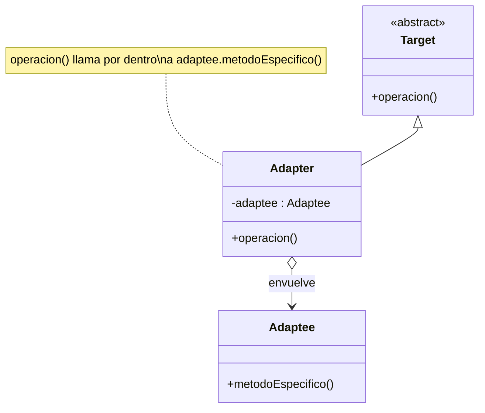
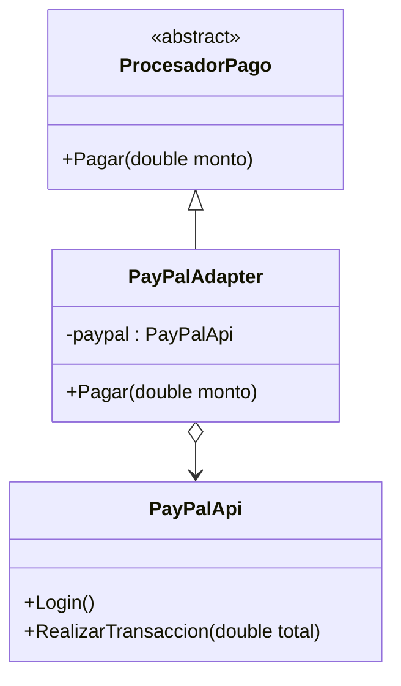
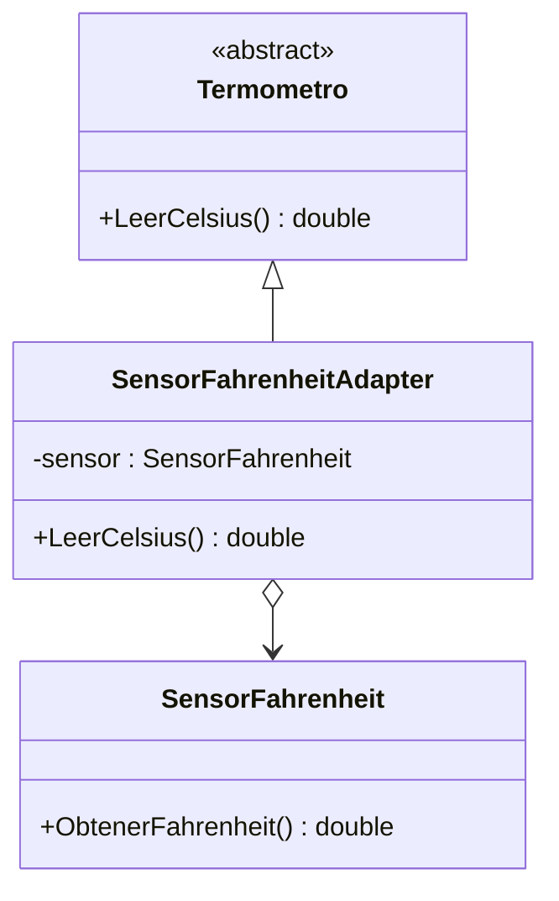

# Patrón Adapter (Adaptador)

## ¿Qué resuelve?
Permite que **dos interfaces incompatibles trabajen juntas**. Envuelve un objeto existente (que ya funciona pero tiene "otra interfaz") y lo expone con la interfaz que el cliente espera.

> **Idea clave:** "Tengo una clase que sirve, pero sus métodos no encajan con lo que mi sistema pide. Le pongo un traductor en el medio."
> Lo reconocés cuando hay una clase **que no podés (o no querés) modificar** (el *Adaptee*) y una interfaz objetivo distinta (*Target*).

## Estructura del patrón

| Rol | Ejemplo de la cátedra (Motores) |
|-----|----------------------------------|
| **Target** (lo que el cliente espera) | `Motor` con `Arrancar/Acelerar/Detener/CargarCombustible` |
| **Adaptee** (lo incompatible) | `MotorElectrico` con `Conectar/Activar/Mover/Enchufar...` |
| **Adapter** | `MotorElectricoAdapter` (traduce de Motor → MotorElectrico) |
| **Client** | `Program` que usa `Motor` |

## Diagrama de clases (genérico)



---

## Ejercicio 1 — Pasarela de pagos

> Nuestro sistema procesa pagos con la interfaz `ProcesadorPago.Pagar(monto)`. Queremos integrar la librería externa `PayPalApi`, que tiene métodos distintos (`Login`, `RealizarTransaccion`). No podemos modificar PayPal: creamos un adapter.

### Diagrama



### Código

```csharp
// ---------- Target: lo que nuestro sistema espera ----------
public abstract class ProcesadorPago
{
    public abstract void Pagar(double monto);
}

// ---------- Adaptee: librería externa con OTRA interfaz ----------
public class PayPalApi
{
    public void Login()
    {
        Console.WriteLine("PayPal: sesión iniciada.");
    }

    public void RealizarTransaccion(double total)
    {
        Console.WriteLine($"PayPal: transacción de ${total} realizada.");
    }
}

// ---------- Adapter: traduce Pagar() a la API de PayPal ----------
public class PayPalAdapter : ProcesadorPago
{
    private PayPalApi _paypal = new PayPalApi();

    public override void Pagar(double monto)
    {
        // Adaptamos la secuencia que PayPal necesita a un solo método
        _paypal.Login();
        _paypal.RealizarTransaccion(monto);
    }
}

// ---------- Cliente: sólo conoce ProcesadorPago ----------
class Program
{
    static void Main()
    {
        ProcesadorPago procesador = new PayPalAdapter();
        procesador.Pagar(1500);
    }
}
```

---

## Ejercicio 2 — Sensor de temperatura (unidades distintas)

> El tablero del sistema muestra la temperatura en Celsius vía `Termometro.LeerCelsius()`. Tenemos un sensor importado `SensorFahrenheit` que sólo devuelve Fahrenheit. El adapter convierte la unidad.

### Diagrama



### Código

```csharp
public abstract class Termometro
{
    public abstract double LeerCelsius();
}

// Adaptee: sólo sabe de Fahrenheit
public class SensorFahrenheit
{
    public double ObtenerFahrenheit() => 98.6; // valor simulado
}

public class SensorFahrenheitAdapter : Termometro
{
    private SensorFahrenheit _sensor = new SensorFahrenheit();

    public override double LeerCelsius()
    {
        double f = _sensor.ObtenerFahrenheit();
        return (f - 32) * 5 / 9; // conversión F -> C
    }
}

class Program
{
    static void Main()
    {
        Termometro termometro = new SensorFahrenheitAdapter();
        Console.WriteLine($"Temperatura: {termometro.LeerCelsius():0.0} °C");
    }
}
```

---

## Cómo lo reconocés en un parcial
- Hay una clase **ya existente / externa / legacy** que no se puede cambiar.
- El cliente espera **otra interfaz** distinta a la que esa clase ofrece.
- Frase clave: *"hacer compatible", "integrar una librería", "interfaces que no encajan"*.
- El adapter **tiene por dentro** (composición) al objeto adaptado y **hereda/implementa** la interfaz objetivo.
```
