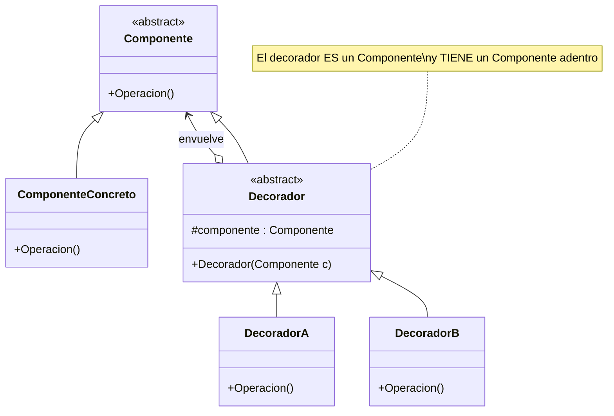
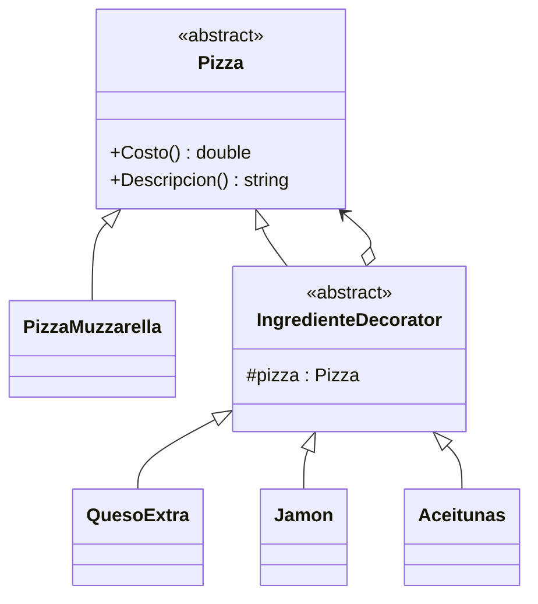
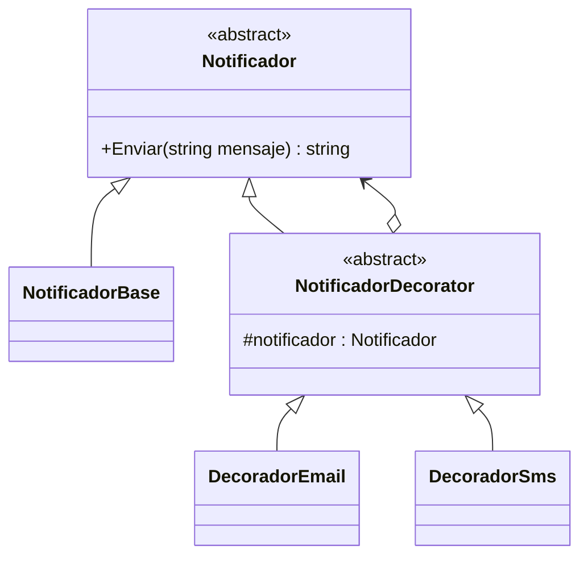

# Patrón Decorator (Decorador)

## ¿Qué resuelve?
Permite **agregar responsabilidades/funcionalidad a un objeto dinámicamente**, envolviéndolo en "capas", sin tocar su clase ni crear una explosión de subclases.

> **Idea clave:** "Un objeto base + agregados apilables que se envuelven uno dentro de otro."
> Cada decorador **es-un** componente Y **tiene-un** componente (hereda de la misma base y guarda una referencia adentro). Por eso puede llamar al de adentro y sumarle algo.

## Estructura del patrón

| Rol | Ejemplo de la cátedra (Bebidas) |
|-----|----------------------------------|
| **Component** (abstracto) | `BebidaComponent` (`Costo`, `Descripcion`) |
| **ConcreteComponent** (base) | `CafeSolo`, `TeTradicional` |
| **Decorator** (abstracto) | `AgregadoDecorator` (guarda `_bebida`) |
| **ConcreteDecorator** | `Leche`, `Azucar`, `Crema`, `Canela` |

## Diagrama de clases (genérico)



---

## Ejercicio 1 — Pizza con ingredientes extra

> Una pizza base tiene un costo y una descripción. Le podés agregar ingredientes (queso extra, jamón, aceitunas) que suman al precio y a la descripción. Los agregados se apilan en cualquier combinación.

### Diagrama



### Código

```csharp
// ---------- Component ----------
public abstract class Pizza
{
    public abstract double Costo { get; }
    public abstract string Descripcion { get; }
}

// ---------- Componente concreto (base) ----------
public class PizzaMuzzarella : Pizza
{
    public override double Costo => 2000;
    public override string Descripcion => "Pizza de muzzarella";
}

// ---------- Decorador abstracto ----------
public abstract class IngredienteDecorator : Pizza
{
    protected Pizza _pizza;
    public IngredienteDecorator(Pizza pizza)
    {
        _pizza = pizza;
    }
}

// ---------- Decoradores concretos ----------
public class QuesoExtra : IngredienteDecorator
{
    public QuesoExtra(Pizza pizza) : base(pizza) { }
    public override double Costo => _pizza.Costo + 500;
    public override string Descripcion => $"{_pizza.Descripcion}, queso extra";
}

public class Jamon : IngredienteDecorator
{
    public Jamon(Pizza pizza) : base(pizza) { }
    public override double Costo => _pizza.Costo + 700;
    public override string Descripcion => $"{_pizza.Descripcion}, jamón";
}

public class Aceitunas : IngredienteDecorator
{
    public Aceitunas(Pizza pizza) : base(pizza) { }
    public override double Costo => _pizza.Costo + 300;
    public override string Descripcion => $"{_pizza.Descripcion}, aceitunas";
}

// ---------- Cliente: apila decoradores ----------
class Program
{
    static void Main()
    {
        Pizza pizza = new PizzaMuzzarella();
        pizza = new QuesoExtra(pizza);
        pizza = new Jamon(pizza);
        pizza = new Aceitunas(pizza);

        Console.WriteLine($"{pizza.Descripcion} = ${pizza.Costo}");
        // Pizza de muzzarella, queso extra, jamón, aceitunas = $3500
    }
}
```

---

## Ejercicio 2 — Notificaciones con canales adicionales

> Una notificación base se envía por la app. Se le pueden "decorar" canales extra: que además mande Email y/o SMS. Cada decorador agrega su envío al del componente que envuelve.

### Diagrama



### Código

```csharp
public abstract class Notificador
{
    public abstract string Enviar(string mensaje);
}

public class NotificadorBase : Notificador
{
    public override string Enviar(string mensaje) => $"App: {mensaje}";
}

public abstract class NotificadorDecorator : Notificador
{
    protected Notificador _notificador;
    public NotificadorDecorator(Notificador notificador)
    {
        _notificador = notificador;
    }
}

public class DecoradorEmail : NotificadorDecorator
{
    public DecoradorEmail(Notificador n) : base(n) { }
    public override string Enviar(string mensaje)
        => _notificador.Enviar(mensaje) + $" | Email: {mensaje}";
}

public class DecoradorSms : NotificadorDecorator
{
    public DecoradorSms(Notificador n) : base(n) { }
    public override string Enviar(string mensaje)
        => _notificador.Enviar(mensaje) + $" | SMS: {mensaje}";
}

class Program
{
    static void Main()
    {
        Notificador n = new NotificadorBase();
        n = new DecoradorEmail(n);
        n = new DecoradorSms(n);

        Console.WriteLine(n.Enviar("Tenés una alerta"));
        // App: Tenés una alerta | Email: Tenés una alerta | SMS: Tenés una alerta
    }
}
```

---

## Cómo lo reconocés en un parcial
- Piden **agregar features de a capas / combinables** sin crear una subclase por combinación.
- El objeto base y los agregados **comparten la misma interfaz**.
- Frase clave: *"agregar dinámicamente", "ingredientes/adicionales", "envolver"*.
- ⚠️ **Diferencia con Adapter:** el Adapter **cambia la interfaz** de un objeto; el Decorator **mantiene la misma interfaz** pero le suma comportamiento.
```
