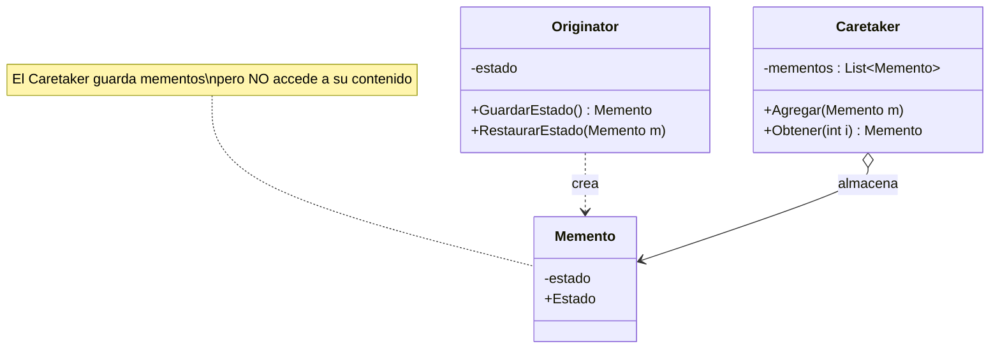
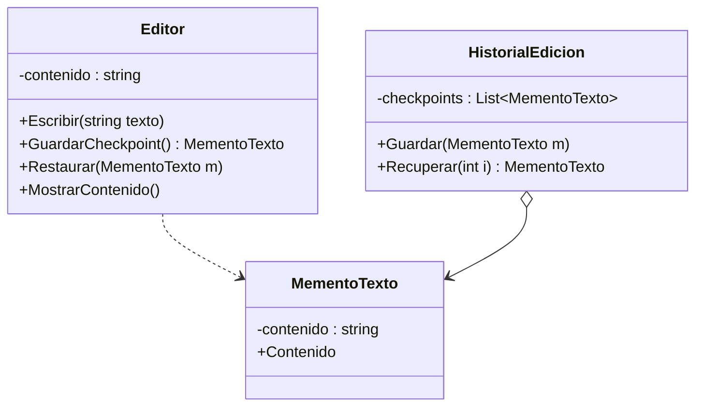
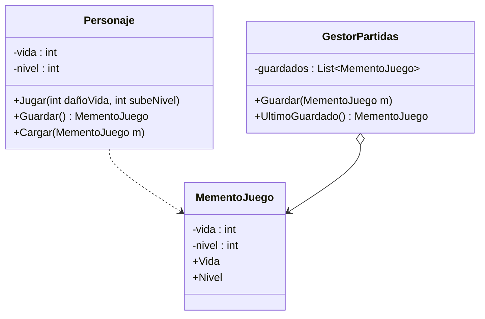

# Patrón Memento (Recuerdo)

## ¿Qué resuelve?
Permite **guardar y restaurar el estado de un objeto** sin violar su encapsulamiento (sin exponer sus campos internos). Es la base del "deshacer" (undo) y de los checkpoints.

> **Idea clave:** "Saco una foto del estado, la guardo en una caja, y después puedo volver a esa foto."
> Tres roles: el que tiene el estado (**Originator**), la foto (**Memento**) y el que guarda las fotos (**Caretaker**).

## Estructura del patrón

| Rol | Ejemplo de la cátedra (Persona) | Responsabilidad |
|-----|----------------------------------|-----------------|
| **Originator** | `Persona` | Crea el memento (`saveToMemento`) y se restaura desde él (`restoreToMemento`) |
| **Memento** | `Memento` | Guarda el estado. Sólo lectura desde afuera |
| **Caretaker** | `CareTaker` | Guarda la lista de mementos. **No mira adentro** del memento |

## Diagrama de clases (genérico)



---

## Ejercicio 1 — Editor de texto con "Deshacer"

> Un editor escribe texto. Antes de cada cambio importante guarda un checkpoint. Si el usuario se arrepiente, puede volver a una versión anterior.

### Diagrama



### Código

```csharp
// ---------- Memento ----------
public class MementoTexto
{
    private readonly string _contenido;
    public MementoTexto(string contenido)
    {
        _contenido = contenido;
    }
    public string Contenido => _contenido; // sólo lectura
}

// ---------- Originator ----------
public class Editor
{
    private string _contenido = "";

    public void Escribir(string texto)
    {
        _contenido += texto;
    }

    public MementoTexto GuardarCheckpoint()
    {
        Console.WriteLine($"Guardando checkpoint: \"{_contenido}\"");
        return new MementoTexto(_contenido);
    }

    public void Restaurar(MementoTexto m)
    {
        _contenido = m.Contenido;
        Console.WriteLine($"Restaurado a: \"{_contenido}\"");
    }

    public void MostrarContenido() => Console.WriteLine($"Contenido actual: \"{_contenido}\"");
}

// ---------- Caretaker ----------
public class HistorialEdicion
{
    private List<MementoTexto> _checkpoints = new List<MementoTexto>();

    public void Guardar(MementoTexto m) => _checkpoints.Add(m);
    public MementoTexto Recuperar(int i) => _checkpoints[i];
}

// ---------- Cliente ----------
class Program
{
    static void Main()
    {
        Editor editor = new Editor();
        HistorialEdicion historial = new HistorialEdicion();

        editor.Escribir("Hola ");
        historial.Guardar(editor.GuardarCheckpoint());

        editor.Escribir("mundo");
        historial.Guardar(editor.GuardarCheckpoint());

        editor.Escribir(" BORRADOR");
        editor.MostrarContenido();           // "Hola mundo BORRADOR"

        editor.Restaurar(historial.Recuperar(1)); // vuelve a "Hola mundo"
        editor.MostrarContenido();
    }
}
```

---

## Ejercicio 2 — Checkpoints de un videojuego

> En un juego el personaje tiene vida y nivel. Antes de una pelea difícil se guarda el progreso. Si el jugador pierde, se carga el último checkpoint.

### Diagrama



### Código

```csharp
public class MementoJuego
{
    public int Vida { get; }
    public int Nivel { get; }
    public MementoJuego(int vida, int nivel)
    {
        Vida = vida;
        Nivel = nivel;
    }
}

public class Personaje
{
    private int _vida = 100;
    private int _nivel = 1;

    public void Jugar(int dañoVida, int subeNivel)
    {
        _vida -= dañoVida;
        _nivel += subeNivel;
        Console.WriteLine($"Jugando... Vida={_vida}, Nivel={_nivel}");
    }

    public MementoJuego Guardar()
    {
        Console.WriteLine("Checkpoint guardado.");
        return new MementoJuego(_vida, _nivel);
    }

    public void Cargar(MementoJuego m)
    {
        _vida = m.Vida;
        _nivel = m.Nivel;
        Console.WriteLine($"Partida cargada -> Vida={_vida}, Nivel={_nivel}");
    }
}

public class GestorPartidas
{
    private List<MementoJuego> _guardados = new List<MementoJuego>();
    public void Guardar(MementoJuego m) => _guardados.Add(m);
    public MementoJuego UltimoGuardado() => _guardados[_guardados.Count - 1];
}

class Program
{
    static void Main()
    {
        Personaje heroe = new Personaje();
        GestorPartidas gestor = new GestorPartidas();

        heroe.Jugar(20, 1);                 // Vida=80, Nivel=2
        gestor.Guardar(heroe.Guardar());    // checkpoint

        heroe.Jugar(90, 0);                 // Vida=-10 (murió)
        heroe.Cargar(gestor.UltimoGuardado()); // vuelve a Vida=80, Nivel=2
    }
}
```

---

## Cómo lo reconocés en un parcial
- Piden **deshacer / restaurar / volver atrás / guardar estado / checkpoint / historial**.
- Hay que guardar el estado **sin romper el encapsulamiento** (sin hacer públicos los campos).
- Frase clave: *"undo", "snapshot", "guardar y recuperar el estado anterior"*.
- Recordá los **3 roles**: Originator (tiene el estado), Memento (la foto), Caretaker (la colección de fotos, no la mira por dentro).
```
